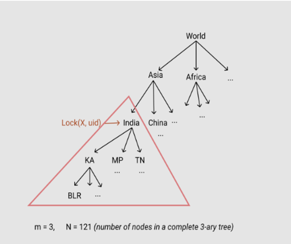
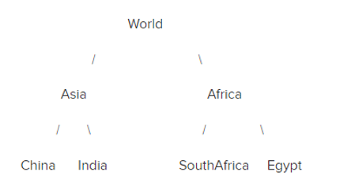
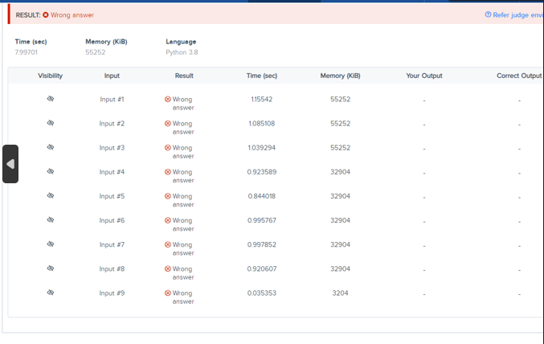

# Hackathon Part A - Locking the tree of space

## [Leetcode Question : Operations on Tree](https://leetcode.com/problems/operations-on-tree/description/)

- [Try it here](https://leetcode.com/problems/operations-on-tree/description/)

Time : 3 hours
Max Score : 300

You have a world map represented as an M-Ary tree (sample tree below)



You need to define three operations on it

1. `lock(X, uid)`
2. `unlock(X, uid)`
3. `upgradeLock(x, uid)`

where X the name of a node in the tree (that would be unique) and uid is the user who is performing the operation.

Here are the definitions for the Operations :

## Lock(X, uid)

Lock takes an exclusive access on the subtree rooted at X. It is formally defined like this:

Once lock(X, uid) succeeds, then:

- lock(A, anyUserId) should fail (returns false), where A is a desdendent of X,
- lock(B, anyUserId) should fail (returns false), where X is a descendant of B
- Lock operation cannot be performed on a node which is already locked i.e., lock(X, anyUserId) should fail (returns false).

## Unlock(X, uid)

- Unlock reverts what was done by the Lock operation. It can only be called on same node on which user uid had called a Lock on before. Returns true if it is successful.

## UpgradeLock(X, uid)

- It helps the user uid upgrade their lock to an ancestor node. It is only possible if the node X already has locked descendants and all of them are only locked by the same user uid. Upgrade should fail if there is any node which is descendant of X that is locked by a different user. Successful Upgrade will 'Lock' the node. UpgradeLock call shouldn't violate the consistency mode that Lock/Unlock function requires.

## Notes

1. The number of nodes in the tree N is very large. So, optimize the time complexity for the above algorithms.

2. The below section contains the input format

- The first line contains the **number** of Nodes in the tree (**N**)
- The second line contains **number** of children per node (value **m** in m-ary tree).
- The third line contains **number** of queries (**Q**)
- Next **N** lines contains the **NodeName** (string) in the m-Ary tree.
- Next **Q** lines contains queries which are in format : **OperationType NodeName UserId**
- **OperationType** ->
  - **1** for Lock
  - **2** for unlock
  - **3** for upgradeLock
- **NodeName** -> Name of any node (unique) in m-Ary Tree
- **UserId** -> Integer value representing a unique user

## Example Input

7  
2  
3  
World  
Asia  
China  
India  
SouthAfrica  
Egypt  
1 China 9  
2 India 9  
3 Asia 9

With the above input you represents a 2-ary tree iwth 7 nodes as follows :



### Additional Notes

1. Here **'1 China 3'** indicates the following **'OperationType NodeName UserId'**

2. The tree is always **fully balanced**

3. Constraints on the inpupts are as follows

   - 1 < **N** < 5 \_ 10^5
   - 1 < **m** < 30
   - 1 < **Q** < 5 \_ 10^5
   - 1 < length of **NodeName** < 20

4. Optimize the **time complexity**

- Lock - O(logm N)
- Unlock - O(logm N)
- UpgradeLock - O(numberOfLockedNodes \* logm N)

5. Lock operation on already locked node should fail

6. Once UpgradeLock(X, uid) succeeds on X. It is equivalent to X being locked by uid. So, Lock(A/B, anyuser) should fail as per the definition of Lock and Unlock(X, uid) should also work.

7. Upgrade lock operation on a node having no locked descendants should fail and upgrade lock on already locked node should also fail.

### Sample Input

7  
2  
5  
World  
Asia  
Africa  
China  
India  
SouthAfrica  
Egypt  
1 China 9  
1 India 9  
3 Asia 9  
2 India 9  
2 Asia 9

### Sample Output

true  
true  
true  
false  
true

### Explanation

#### Query 1 : 1 China 9 :

This operation is success as initially China is unlocked

#### Query 2 : 1 India 9

This should be success as none of ancestors and descendants of India are locked

#### Query 3 : 3 Asia 9

This also should be success as upgrade operation is done by same user who has locked descendants

#### Query 4 : 2 India 9

This should fail as the India is now not locked

#### Query 5 : 2 Asia 9

This should be success as Asia was earlier (refer Query 3) locked by user 9

## Note :

Your code must be able to print the sample output from the sample input. However, your code is run against multiple hidden test cases. Therefore, your code must pass these hidden test cases to solve the problem statement.

#### Limits

Time Limit : 0.6 sec(s) for each input file  
Memoery Limit : 256 MB  
Source Limit : 1024 KB



## Sample Inputs and Outputs

### Sample Input 1

```
7
2
5
World
Asia
Africa
China
India
SouthAfrica
Egypt
1 China 9
1 India 9
3 Asia 9
2 India 9
2 Asia 9
```

### Sample Output 1

```
true
true
true
false
true
```

### Sample Input 2

```
7
2
3
World
Asia
Africa
China
India
SouthAfrica
Egypt
1 China 9
2 India 9
3 Asia 9
```

### Sample Output 2

```
true
false
true
```
